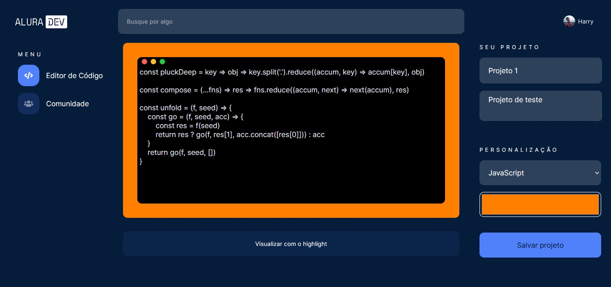
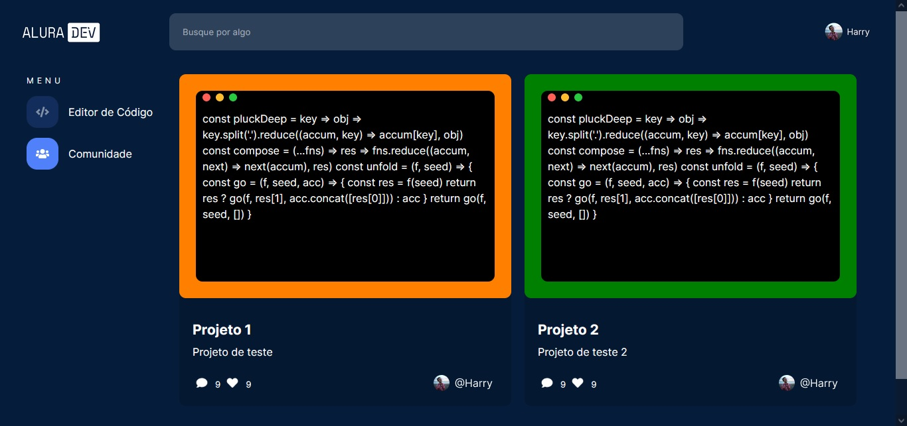

# Challenge Front End 1ª Edição

Esse desafio aconteceu de 17/05 a 11/06 de 2021.

Comecei ele em 04/11 de 2022. Os objetivos ainda estão disponiveis para alunos da Alura, mas a comunidade de suporte já foi encerrada, mas fiz o meu melhor sozinho.

## Objetivo 

A ideia do projeto é ter um editor de código com syntax highlight, que salva localmente o conteúdo e configurações e exibe na página de comunidade. O 

## Funcionamento

O conteúdo digitado no editor é associado com os dados preenchidos no formulário.

A página comunidade exibe os itens salvos no editor.

## Linguagens

HTML5 | CSS3 | JavaScript

## Ferramentas

Figma | Trello

## Bibliotecas

Highlight.js

## Notas

O projeto ainda não está finalizado, falta fazer:

- O editor utilizando um framework SPA
- Exportar código em png, svg ou jpg
- Responsividade do projeto
